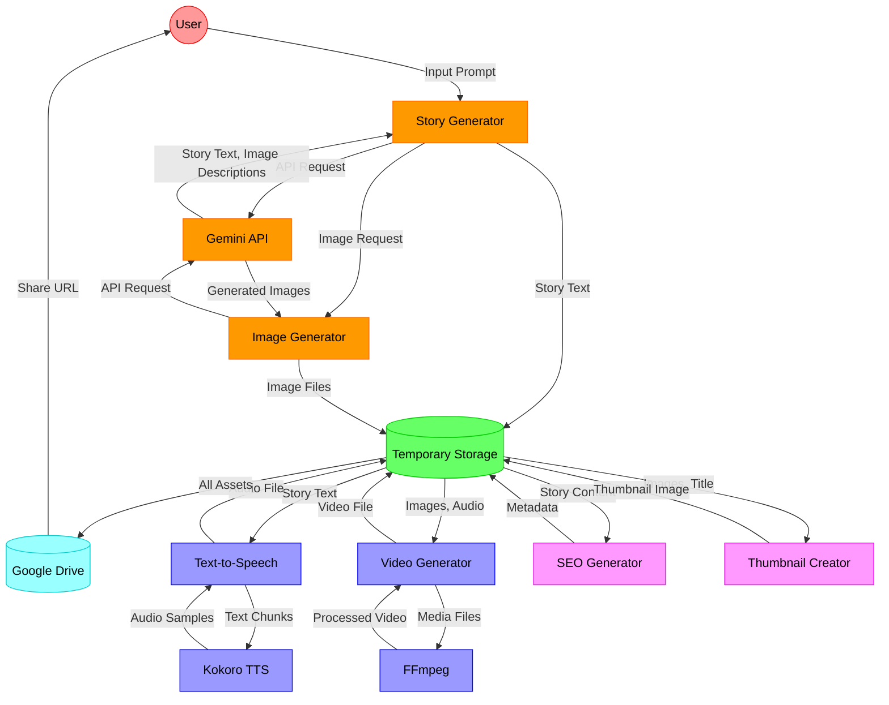

```mermaid
flowchart TD
    classDef userInterface fill:#FF9999,stroke:#FF0000,color:#000000
    classDef aiService fill:#FF9900,stroke:#FF6600,color:#000000
    classDef dataStore fill:#66FF66,stroke:#00CC00,color:#000000
    classDef mediaProcessing fill:#9999FF,stroke:#0000FF,color:#000000
    classDef metadataService fill:#FF99FF,stroke:#FF00FF,color:#000000
    classDef cloudService fill:#99FFFF,stroke:#00CCCC,color:#000000
    
    User((User)):::userInterface
    
    GoogleDrive[(Google Drive)]:::cloudService
    
    StoryGen[Story Generator]:::aiService
    ImageGen[Image Generator]:::aiService
    TTS[Text-to-Speech]:::mediaProcessing
    VideoGen[Video Generator]:::mediaProcessing
    SEO[SEO Generator]:::metadataService
    Thumbnail[Thumbnail Creator]:::metadataService
    
    TempStorage[(Temporary Storage)]:::dataStore
    
    GeminiAPI[Gemini API]:::aiService
    KokoroTTS[Kokoro TTS]:::mediaProcessing
    FFmpeg[FFmpeg]:::mediaProcessing
    
    User --> |Input Prompt| StoryGen
    StoryGen --> |API Request| GeminiAPI
    GeminiAPI --> |Story Text, Image Descriptions| StoryGen
    StoryGen --> |Image Request| ImageGen
    ImageGen --> |API Request| GeminiAPI
    GeminiAPI --> |Generated Images| ImageGen
    
    StoryGen --> |Story Text| TempStorage
    ImageGen --> |Image Files| TempStorage
    
    TempStorage --> |Story Text| TTS
    TTS --> |Text Chunks| KokoroTTS
    KokoroTTS --> |Audio Samples| TTS
    TTS --> |Audio File| TempStorage
    
    TempStorage --> |Images, Audio| VideoGen
    VideoGen --> |Media Files| FFmpeg
    FFmpeg --> |Processed Video| VideoGen
    VideoGen --> |Video File| TempStorage
    
    TempStorage --> |Story Content| SEO
    SEO --> |Metadata| TempStorage
    
    TempStorage --> |Images, Title| Thumbnail
    Thumbnail --> |Thumbnail Image| TempStorage
    
    TempStorage --> |All Assets| GoogleDrive
    GoogleDrive --> |Share URL| User
```
